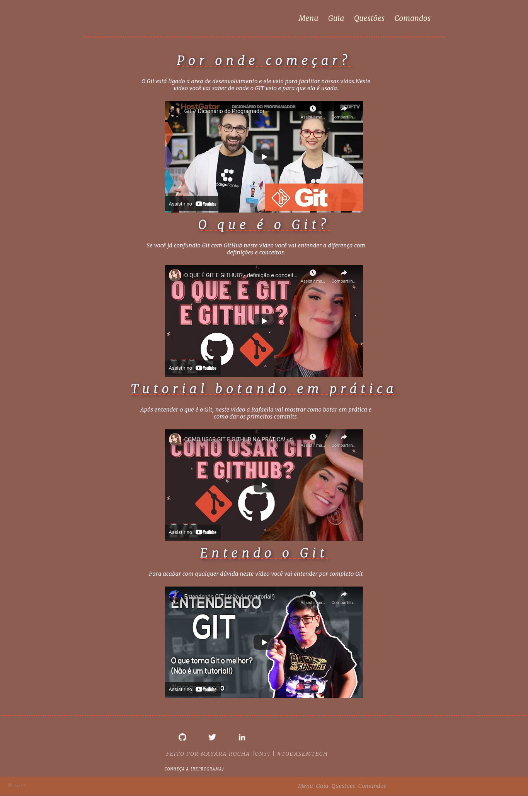

# Tudo Sobre o Git  meu projeto final.
Meu projeto final da Reprograma sera com o tema : Tudo Sobre o Git. Desde que comecei a estudar programação o git sempre me deixou muito confusa, após entrar na reprograma eu entendi e espero que este projeto ajude a entender melhor esta ferramenta que os programados tem que saber usar.

## Descrição do projeto
 #### `Página Menu`
 >> ...A primeira  página mostra as informações sobre o **Git**, tem um botão que leva diretamente para o link onde você pode baixar o Git em qualquer computador, algumas dicas de como aprender melhor o **Git**,abaixo três qualidades do Git.No sobre mim, vou falar um pouco de quem eu sou...
 

#### `Página Guia`
>>...A página guia se trate de videos que ajudam a entender de todas a s formas o **Git**, mostrando em uma sequência de quais videos ver primeiro ...
 

#### `Página Comandos`
>>...A página de Comandos tem como utilizade ajudar a encontrar os códigos que você precisa para a sua duvida, você pode seguir pelo indice, cada código tem sua explicação de como funciona e como usa-los ...
 

### 🛠 Tecnologias

As seguintes ferramentas foram usadas na construção do projeto:

- [HTML](https://www.w3schools.com/html/)
- [CSS](https://www.w3schools.com/cssref/)
- [React](https://pt-br.reactjs.org/)
- [JavaScript](https://developer.mozilla.org/pt-BR/docs/Web/JavaScript)

Feito com ❤️ por Mayara Rocha 👋🏽 Entre em contato!
 
 
   
